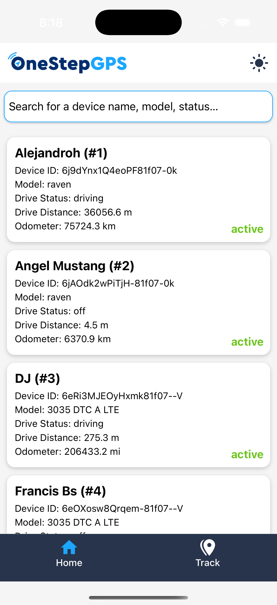
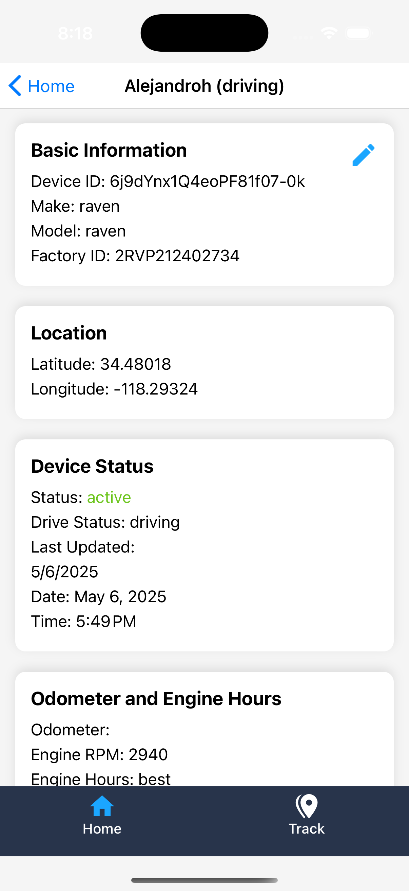
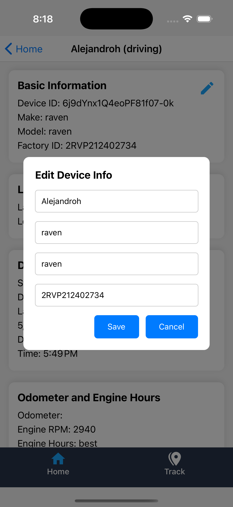
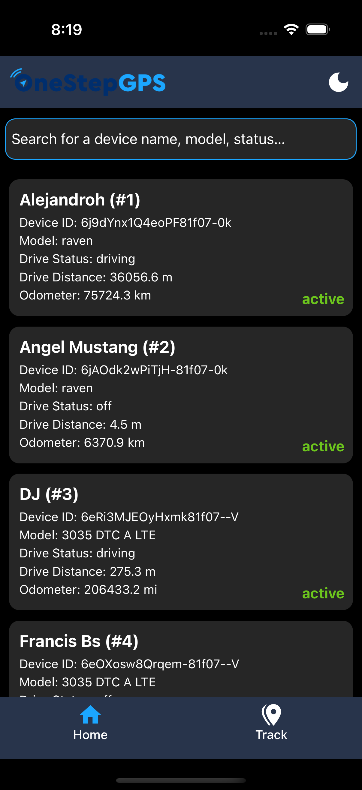
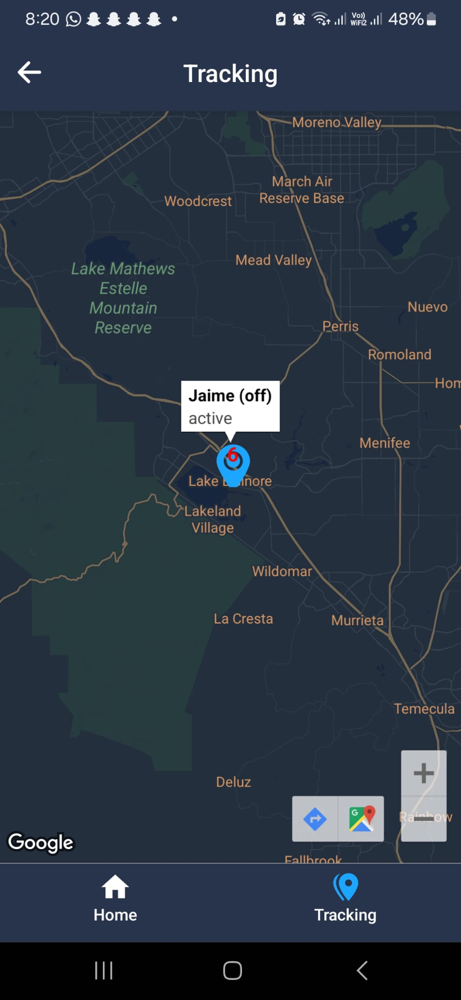
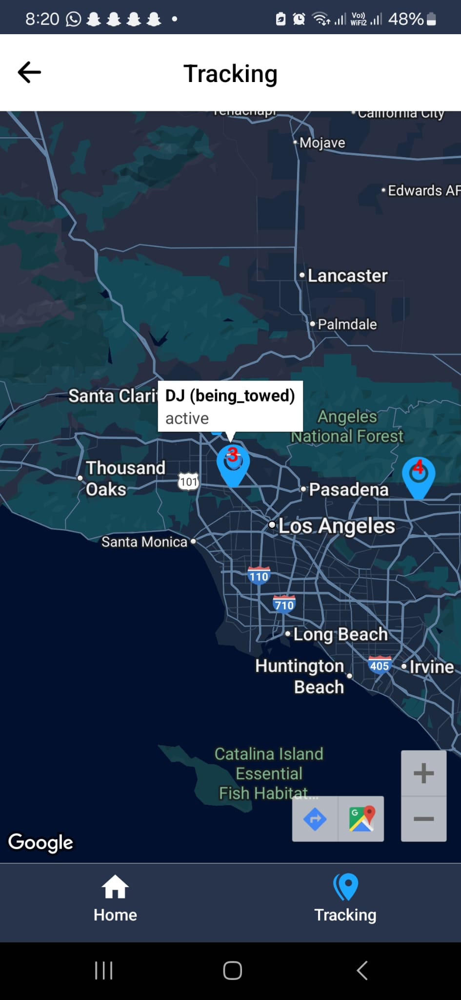

# 📍 One Step GPS React Native App

This React Native mobile application was developed as part of the One Step GPS technical challenge. It demonstrates real-time GPS device tracking, local storage of user preferences, and an interactive UI with a custom map view.

## 🚀 Features

- 🔄 **Device Fetching** – Fetches real-time device data from One Step GPS API
- 🗺️ **Map View** – Displays devices using custom markers with status and numbering
- 📋 **Device List View** – Searchable list with device name, status, and details
- 🛠️ **Preferences Storage** – Stores device metadata and theme settings locally
- 🔃 **Live Updates** – Refreshes tracking data every 10 seconds
- 🎨 **Theme Support** – Light/dark/system theme switching

## 🧱 Tech Stack

- React Native (CLI)
- `react-native-maps`
- AsyncStorage
- Context API
- Metro Bundler
- Android and iOS support

---

## ⚙️ Getting Started

> **Ensure you’ve followed the official [React Native Environment Setup](https://reactnative.dev/docs/environment-setup)**

### 📦 Install Dependencies

```bash
npm install
# or
yarn install

# start the app
npm start
# or
yarn start

# run ios
npm run ios

#run andoid
npm run android


---

## 📸 Screenshots

|  |  |  |
|--|--|--|
|  |  |  |
|  |  |  |
|  |  |  |
